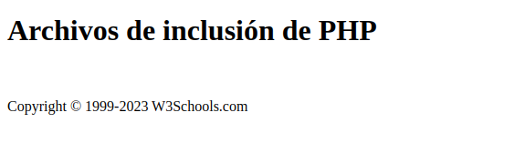
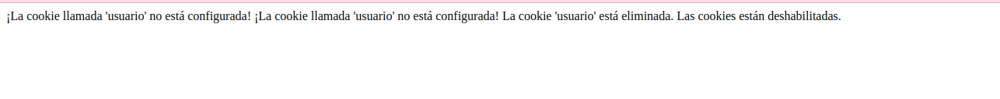
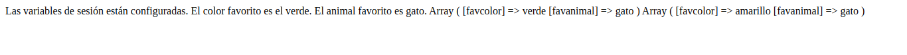
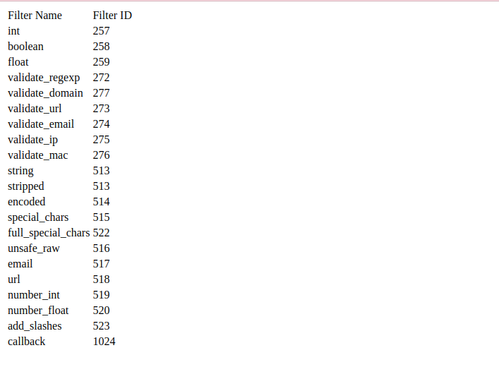
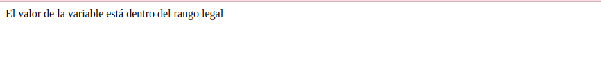
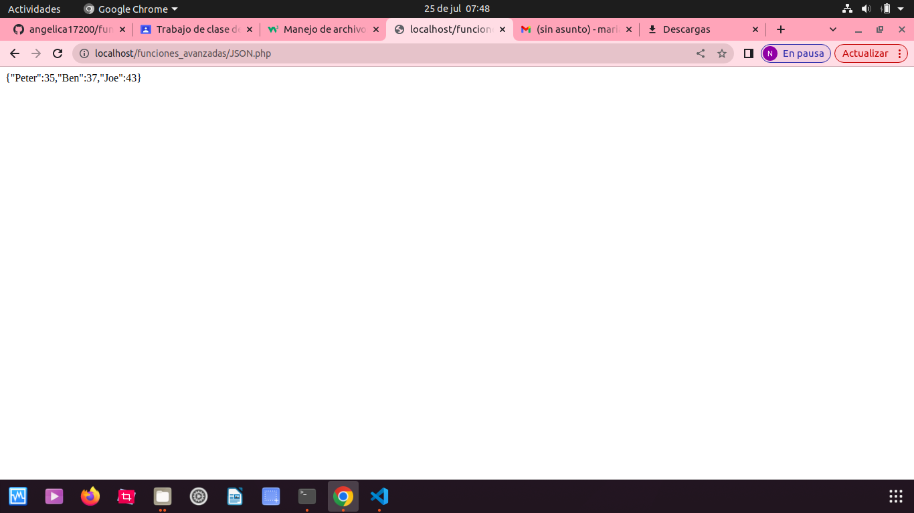

# funciones_avanzadas

## FECHA Y HORA 

# Ejercio 1 - obtener una cita

- Especifica cómo fomatear la fecha(o la hora)

# Ejercicio 2 - año

- ésta función actuliza el año 

# Ejercicio 3 - obtener un tiempo

- Nos da el tiempo 

# Ejercicio 4 - obtenga su zona horaria

- Si la hora que recibió del código no es correcta, probablemente se deba a que su servidor está en otro país o está configurado para una zona horaria diferente.

- Por lo tanto, si necesita que la hora sea correcta según una ubicación específica, puede configurar la zona horaria que desea usar.

# Ejercicio 5 - Crear una fecha con mktime

- El parámetro de marca de tiempo opcional en la función date() especifica una marca de tiempo. Si se omite, se utilizará la fecha y la hora actuales (como en los ejemplos anteriores).

# Ejercicio 6 - otros ejemplos

- La función PHP mktime()devuelve la marca de tiempo de Unix para una fecha. La marca de tiempo de Unix contiene el número de segundos entre la Época de Unix (1 de enero de 1970 00:00:00 GMT) y la hora especificada.

# Ejercicio 6 - mas de ejemplos de más fechas 

 

- El siguiente ejemplo muestra las fechas de los próximos seis sábados:

# Ejercicio 6 - # de Días hasta el 4 de julio

- El siguiente ejemplo muestra el número de días hasta el 4 de julio:

"""

# INCLUIR 
- Para incluir el archivo de pie de página en una página, utilice la includedeclaración:
# Ejercicio 1 - Archivos de inclusión de PHP

# Manejo de archivos php

# ejemplos

# archivos php

# Archivos crear php

# carga de archivos 

# cookis 

# sesiones php

# filtros php 

# filtros avanzados 

# Funciones de devolucion de llamada 

# phpJONS

# EXCEPCIONES PHP

